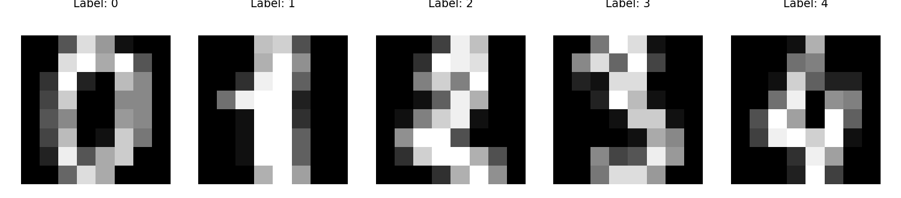
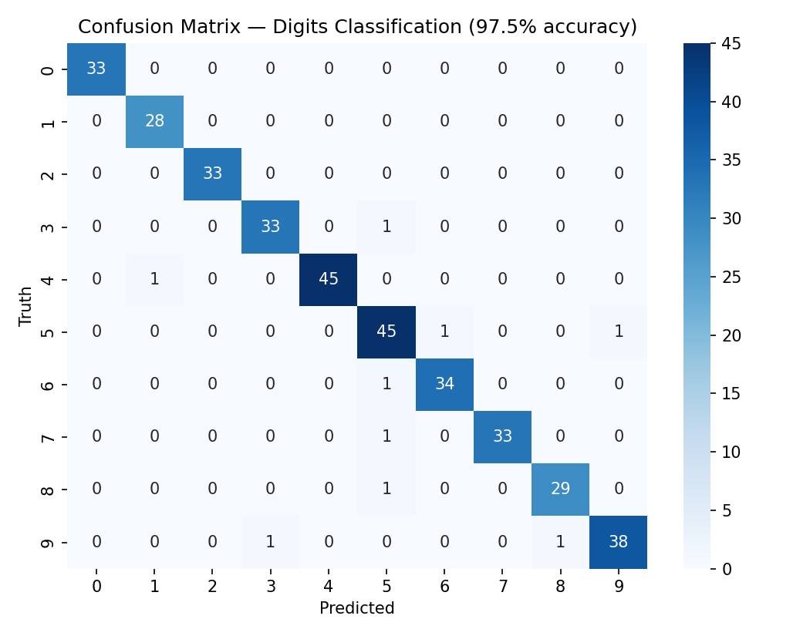
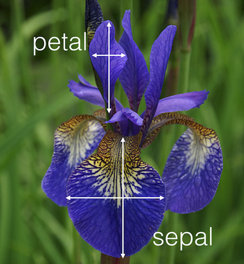
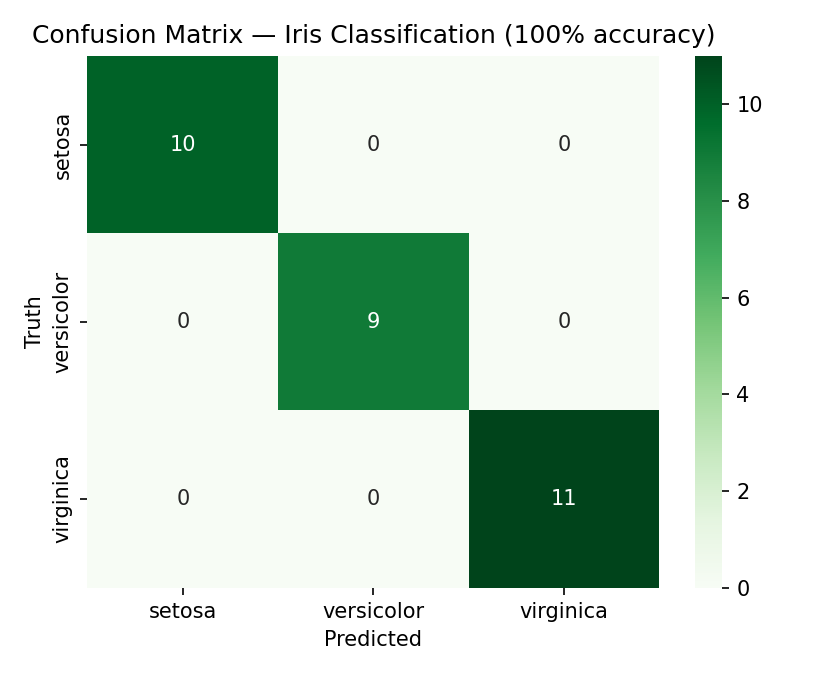
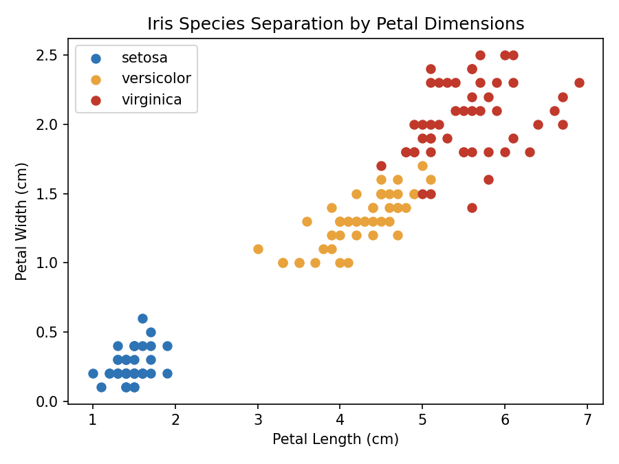

# Multiclass Logistic Regression — Handwritten Digits & Iris Species Classification

Two multiclass classification problems solved with `scikit-learn`'s Logistic Regression: recognizing handwritten digits (10 classes) and classifying iris flower species (3 classes) from their measurements.

---

## 1. Project Objective

Demonstrate that logistic regression — usually introduced as a binary classifier — extends naturally to **multiclass problems** via scikit-learn's built-in one-vs-rest / multinomial handling, using two classic datasets: `load_digits` (handwritten digit recognition) and, as an extension exercise, `load_iris` (flower species classification).

## 2. Part A — Handwritten Digit Recognition

### 2.1 Dataset

| Attribute | Detail |
|---|---|
| Source | `sklearn.datasets.load_digits()` |
| Observations | 1,797 samples |
| Features | 64 (8×8 grayscale pixel intensity values, flattened) |
| Classes | 10 (digits 0–9) |



Each sample is an 8×8 pixel image of a handwritten digit, flattened into a 64-value feature vector — the model never "sees" a 2D image, only the flattened pixel intensities.

### 2.2 Methodology

1. **Load the dataset** via `sklearn.datasets.load_digits()`.
2. **Visual inspection** — plotted several digit images with `plt.matshow()` alongside their true labels to confirm the data loaded correctly.
3. **Train/test split** — 80% train / 20% test.
4. **Model training** — `LogisticRegression` fit directly on the 64 raw pixel features; scikit-learn handles the multiclass extension automatically (softmax/multinomial under the hood).
5. **Evaluation** — accuracy score, sample predictions, and a full confusion matrix visualized as a heatmap.

```python
from sklearn.datasets import load_digits
from sklearn.model_selection import train_test_split
from sklearn.linear_model import LogisticRegression

digits = load_digits()
X_train, X_test, y_train, y_test = train_test_split(digits.data, digits.target, test_size=0.2)

model = LogisticRegression()
model.fit(X_train, y_train)
model.score(X_test, y_test)
```

### 2.3 Results

| Metric | Value |
|---|---|
| **Test Accuracy** | **97.5%** |
| Test set size | 360 samples |



**Per-class performance (precision / recall / F1):**

| Digit | Precision | Recall | F1-score |
|---|---|---|---|
| 0 | 1.00 | 1.00 | 1.00 |
| 1 | 0.97 | 1.00 | 0.98 |
| 2 | 1.00 | 1.00 | 1.00 |
| 3 | 0.97 | 0.97 | 0.97 |
| 4 | 1.00 | 0.98 | 0.99 |
| 5 | 0.92 | 0.96 | 0.94 |
| 6 | 0.97 | 0.97 | 0.97 |
| 7 | 1.00 | 0.97 | 0.99 |
| 8 | 0.97 | 0.97 | 0.97 |
| 9 | 0.97 | 0.95 | 0.96 |

- The model achieves **near-perfect classification** across all 10 digit classes, with digits **0 and 2 classified perfectly**.
- The digit **5 has the lowest precision (0.92)** — the confusion matrix shows it is occasionally mixed up with 6 and 9, which is intuitive given the visual similarity of these digits when handwritten.
- With only 64 simple pixel-intensity features and no convolutional/spatial modeling, 97.5% accuracy is a strong result, illustrating that even a linear multiclass model can perform very well on well-structured image data like this.

## 3. Part B — Iris Species Classification (Exercise)

The notebook's own exercise asks: use the iris dataset's four measurements to classify each flower into one of three species. This was completed as follows.

### 3.1 Dataset

| Attribute | Detail |
|---|---|
| Source | `sklearn.datasets.load_iris()` |
| Observations | 150 samples (50 per species) |
| Features | 4 — Sepal Length, Sepal Width, Petal Length, Petal Width (cm) |
| Classes | 3 — Setosa, Versicolour, Virginica |



### 3.2 Methodology

Same workflow as Part A, applied to the iris data:

```python
from sklearn.datasets import load_iris

iris = load_iris()
X_train, X_test, y_train, y_test = train_test_split(iris.data, iris.target, test_size=0.2, random_state=42)

model = LogisticRegression(max_iter=1000)
model.fit(X_train, y_train)
model.score(X_test, y_test)
```

*(`max_iter` was increased from the default to ensure convergence — the default 100 iterations can be insufficient for this solver/dataset combination.)*

### 3.3 Results

| Metric | Value |
|---|---|
| **Test Accuracy** | **100%** |
| Test set size | 30 samples (10/9/11 per class) |



**Classification report:**

| Species | Precision | Recall | F1-score |
|---|---|---|---|
| Setosa | 1.00 | 1.00 | 1.00 |
| Versicolour | 1.00 | 1.00 | 1.00 |
| Virginica | 1.00 | 1.00 | 1.00 |



- The perfect test accuracy is explained by the scatter plot above: **petal length and width alone almost perfectly separate all three species**, with Setosa fully isolated and only a very thin boundary region between Versicolour and Virginica.
- This is a well-known property of the iris dataset — it is often used specifically *because* it is linearly (near-)separable, making it an ideal sanity-check dataset for a new classification algorithm.

## 4. Comparing the Two Problems

| | Digits | Iris |
|---|---|---|
| Classes | 10 | 3 |
| Features | 64 (raw pixels) | 4 (physical measurements) |
| Samples | 1,797 | 150 |
| Test Accuracy | 97.5% | 100% |

Together, these two problems show logistic regression's versatility: it scales from a **high-dimensional, many-class image problem** (digits) down to a **low-dimensional, few-class tabular problem** (iris) without any change in modeling approach — only the input data changes.

## 5. Key Insights

- Scikit-learn's `LogisticRegression` handles multiclass problems out of the box, with no manual one-vs-rest setup required by the user.
- **Confusion matrices reveal *where* a model struggles**, not just *how much* — e.g., digit 5 being confused with 6/9 is a far more useful diagnostic than the single 97.5% accuracy figure.
- **Visual/exploratory checks matter**: plotting the iris petal scatter plot after the fact explains *why* the model achieved perfect accuracy, turning a suspicious 100% score into a well-understood result rather than a red flag.
- Simple linear models can perform remarkably well when the underlying classes are well-separated in feature space (iris) or the feature representation is already informative (raw pixels for digits, since digit images are centered and normalized).

## 6. Limitations & Next Steps

- **Digits:** no data augmentation or convolutional feature extraction was used; a CNN would likely push accuracy higher still, especially for visually similar digits like 5/6/9.
- **Iris:** the dataset's near-perfect separability means it's a poor test of a model's ability to handle noisy or overlapping classes — good for a first sanity check, not for benchmarking a production classifier.
- **No hyperparameter tuning** (regularization strength `C`, solver choice) was performed for either dataset.
- **No cross-validation** — single train/test splits were used; k-fold CV would give more robust accuracy estimates, particularly for the small 150-sample iris dataset.

## 7. How to Run

```bash
pip install scikit-learn matplotlib seaborn numpy
jupyter notebook 8_logistic_regression_multiclass.ipynb
```

## 8. Repository Contents

| File | Description |
|---|---|
| `8_logistic_regression_multiclass.ipynb` | Main analysis notebook (digits tutorial + iris exercise) |
| `iris_petal_sepal.png` | Reference diagram of iris flower anatomy |
| `digits_samples.png` | Sample handwritten digit images |
| `digits_confusion_matrix.png` | Confusion matrix heatmap for digit classification |
| `iris_confusion_matrix.png` | Confusion matrix heatmap for iris classification |
| `iris_petal_scatter.png` | Petal length vs. width scatter plot by species |
| `README.md` | This report |

## 9. Conclusion

This project demonstrates logistic regression's effectiveness on two distinct multiclass problems: a 10-class handwritten digit recognizer (97.5% accuracy on raw pixel data) and a 3-class iris species classifier (100% accuracy, completing the notebook's own exercise). Beyond fitting the models, confusion matrices and feature-space visualizations were used to explain *why* each model performs the way it does — showing that a headline accuracy number is only the starting point for a proper evaluation, not the end of one.

---
**Tech stack:** Python · scikit-learn · matplotlib · seaborn
